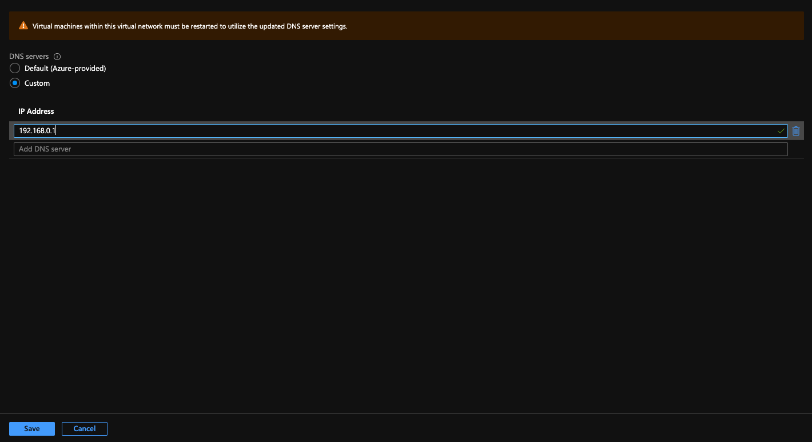

# Configure custom dns for your Azure Red Hat OpenShift (ARO) cluster

This article provides the necessary details that allow you to configure your Azure Red Hat OpenShift cluster (ARO) to use a custom dns server. It contains the cluster requirements for a basic ARO deployment, and more requirements for optional Red Hat and third-party components. An [example](#custom-dns-setup) will be provided at the end on how to configure these requirements with your custom dns. 

## Before you begin

This article assumes that you're creating a new cluster or have an existing cluster with latest updates applied. If you need an ARO cluster, for a public cluster see the [ARO quickstart](./tutorial-create-cluster.md), or for a [private cluster](./howto-create-private-cluster-4x.md).

## DNS Overview

As each node in the Azure Red Hat OpenShift cluster powers on and joins the network, DHCP configures the virtual machine with information such as ip address and which DNS server to use.

Below is the process flow overview of how the configuration is obtained:

An important trade off of using your own DNS server instead of the default DNS server in the virtual network is that you lose the configuration that DNS server provided. You must know that virtual machine names will no longer resolve through DNS on the network. 

### Update Process Overview

Configuring a custom dns server for the cluster is broken down into two steps.

1. Modifying the Virtual Network DNS Servers configuration setting.
2. Restarting nodes in cluster to take changes.

Restarting the each node in the cluster is required as noted in the console when updating DNS configuration.

## Example - Custom DNS

The following steps can be performed through the command line as well, but this documentation will be walking through using the portal web interface.

### Update DNS Configuration in Virtual Network

Log into the azure portal and navigate to the desired virtual network you want to update. Select **DNS servers** from the virtual networks list.

Once you are at the DNS configuration screen, select Custom from the radial button configuration. Enter in the IP addresses for your DNS servers.

>[!IMPORTANT]
> If you choose to specify a custom DNS server, you will no longer be able to resolve node names in the virtual network via DNS. Nodes will only be reachable via IP address.

Select **Save**.

>[!NOTE]
> As shown in the portal interface, you must reboot all virtual machines for the changes to be in place.

You should receive a notification that your update was successful.

### Gracefully reboot your Azure Red Hat OpenShift cluster

The following code snippets create noop `machineconfig`'s for master and worker nodes. This allows you to specify initiating a rolling reboot for either the worker or master nodes.

 

